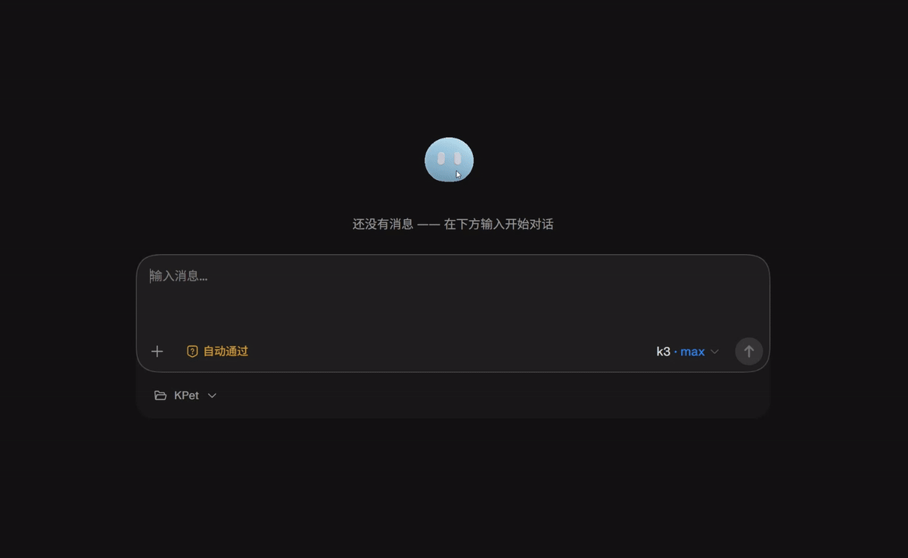

# KPet

English | [简体中文](README.md)



A 3D desktop pet that works alongside Kimi Code.

KPet reads Kimi Code's session and tool events, turning what happens in the terminal into the desktop character's actions and states. It is both a companion pet and a handy Kimi Code session launcher: click a session to summon the terminal, or open Kimi's Web UI in your browser.

## Features

### A Pet That Works

- Enters `Idle` when free: blinks randomly, looks around, and occasionally glances at the mouse.
- Enters `Working` after you submit a request, responding to Kimi Code's execution state with work animations.
- Supports multiple sessions running at once: stays busy as long as any session is still working, returns to idle when all of them finish.
- Retains the latest state while a session or the renderer briefly disconnects, and recovers automatically on reconnect.

### Session Panel

- Click the pet to open or close the session panel; the panel is a web UI (rendered with CEF) showing past and active sessions, with working status and unread-reply markers.
- Click any session to open it in the corresponding Kimi Code context: launch the terminal according to the "Open session with" setting, or open the Kimi Web UI in the browser.
- The panel follows the pet, flips direction automatically at screen edges, and adapts to multi-monitor setups and DPI scaling.

### Settings Panel

- `Ctrl+,` opens or closes the settings panel (with the cursor over the pet).
- Open session with: `CLI` (launch the kimi terminal) or `Web` (open the Kimi Web UI in the system default browser).
- Panel theme, one of three: dark glass `dark-glass`, light minimal `light-minimal`, cute pet `cute-pet`.
- Show frame rates: overlay live FPS for both the 3D rendering and the page UI beside the pet.

### Desktop Interaction

| Action | Effect |
|---|---|
| Left-click the pet | Open or close the session panel |
| Left-drag the pet | Move it on the desktop |
| Press and hold (~0.8s without dragging) | Triggers nothing |
| `R` + left-drag | Adjust the viewing angle |
| `R` + mouse wheel | Zoom the view in or out |
| `ESC` + left-click | Close the pet |
| `Ctrl` + `,` | Open or close the settings panel |

The pet window is always on top but never steals focus from the app you're in. Only the pixels where the character is actually visible receive mouse input; the transparent area around it clicks straight through to the desktop.

### Background Collaboration

- Starts on demand with Kimi Code sessions — no system service registration, no background processes to manage manually.
- Failed host event forwarding never blocks the session; events are staged in `%TEMP%\kpet-events` and processed once connectivity recovers.
- Reconnects automatically when the renderer goes missing; on abnormal exit, the daemon restarts it with 1s / 2s / 4s / 8s backoff (capped at 8s), at most 5 restarts per 60-second window.
- Falls back to `cmd` for opening sessions when Windows Terminal is unavailable.

## Tech Stack

| Component | Main Technology |
|---|---|
| Pet rendering | Unreal Engine 5.8, C++, Scene Capture, RHI, GPU Readback |
| UI | Slate, WebUI |
| Inter-process communication | Windows named pipes, UTF-8 JSON, protocol version 1 |

The system uses a three-process structure — "event relay → daemon → UE5 renderer": the relay (`kpetd.exe --relay`) has an extremely short lifetime and forwards plugin events to the resident daemon (`kpetd.exe --daemon`); the daemon maintains session state and spawns and supervises the renderer process (`Pet.exe`). The rendering pipeline, plugin events, communication protocol, and source layout are documented in the [Technical Documentation](docs/KPetFramework.md).

## Platforms & Deployment

KPet targets Windows 11 and integrates with Kimi Code, supporting both native Windows and WSL deployment.

### Windows 11

Natively supported. After extracting the plugin package, run inside the plugin root:

```powershell
powershell -NoProfile -ExecutionPolicy Bypass -File deploy.ps1
```

The script self-checks package integrity and stops any old daemon. Then, in a Kimi Code session:

```
/plugins install <plugin directory>
```

It takes effect after `/reload` or starting a new session.

> If you're in Git Bash / MSYS on Windows, `deploy.sh` will prompt you to use the native entry point `deploy.ps1` instead.

### WSL (Form 1)

"Form 1" means: you use Kimi Code inside WSL, but the pet's daemon, renderer, and pet window all run on the Windows desktop. The two sides communicate through WSL interop — no graphical environment is needed inside WSL.

Install as follows:

1. **Prepare the plugin package**. Either location works:
   - Extract it on the Windows side (e.g. to `C:\kpet`) and access it from WSL via `/mnt/c/kpet`;
   - Or copy `kpet.zip` into WSL and extract it with `unzip` to a WSL-native path such as your home directory.
2. **Run the deployment script**. In a WSL terminal, enter the plugin root (the directory containing `deploy.sh`) and run:

   ```sh
   sh deploy.sh
   ```

   The script goes through the steps in order: self-checks package integrity (that `bin/kpetd.exe`, `renderer/Pet.exe`, etc. exist), adds the executable bit to `bin/kpet-relay.sh` (zip extraction drops permission bits), swaps the WSL plugin manifest `kimi.plugin.wsl.json` into place as `kimi.plugin.json` (backing up the Windows version as `kimi.plugin.json.bak`), and stops any old daemon. The script is idempotent and safe to re-run.
3. **Install the plugin**. In a Kimi Code session inside WSL (use the path as seen from WSL):

   ```
   /plugins install <plugin directory>
   ```

   For example, if you extracted to `C:\kpet` on Windows, use `/plugins install /mnt/c/kpet`. It then takes effect after `/reload` or starting a new session.

Once deployed, the runtime chain is: Kimi Code's event hook runs `bin/kpet-relay.sh` on the WSL side; the script launches the Windows-side `bin/kpetd.exe` daemon directly via WSL interop; the daemon spawns `renderer/Pet.exe` on first use, and the pet appears on the Windows desktop. If you want clicking a session to launch the WSL terminal, set the `terminal` config option to `wsl` (see "Configuration").

### Not Supported (Yet)

- **macOS**: only Windows builds exist so far; the deployment script explicitly refuses.
- **Plain Linux**: KPet is a Windows / WSL (Form 1) product and does not support direct deployment.

## Configuration

The three common settings — how to open sessions, panel theme, and the FPS overlay — can be changed directly in the settings panel (`Ctrl+,`), and the changes are written back to `%KIMI_CODE_HOME%\kpet\config.json` automatically (falling back to `%USERPROFILE%\.kimi-code\kpet\config.json` when `KIMI_CODE_HOME` is unset).

Options not covered by the settings panel must still be edited manually in that file (each missing field or invalid type falls back to its default):

- `terminal`: how the terminal is launched — `wt` (Windows Terminal), `cmd` (legacy console), or `wsl` (WSL terminal, see the WSL deployment above).
- `open_web_url`: URL template for the web target, supporting the `{session_id}` placeholder; when it points at a loopback address, KPet ensures the local `kimi web` service is available (starts it if the port is free; if occupied, checks whether it is a same-home instance and enters directly, otherwise shifts to the next port), and appends `#token=` for passwordless entry into the Web UI.
- `renderer_path`, heartbeat and restart parameters, `session.staleMinutes` / `cleanupMinutes`, `log_level`, etc.

The complete list of options, their defaults, and runtime file locations (logs, pet window state, staged events) is in the "数据与配置" (Data & Configuration) section of the [Technical Documentation](docs/KPetFramework.md).

## Building from Source & Development

KPet consists of `bridge/` (TypeScript relay & daemon) and `Pet/` (UE 5.8 C++ project). Source layout, development environment requirements, and build and test steps are covered in the "源码结构" (Source Layout), "开发环境" (Development Environment), and "构建与测试" (Build & Test) sections of the [Technical Documentation](docs/KPetFramework.md).

## License & Disclaimer

Released under the [MIT](LICENSE) license.

K仔 (KPet) is a community open-source project with no affiliation to the technologies or large language models it uses.